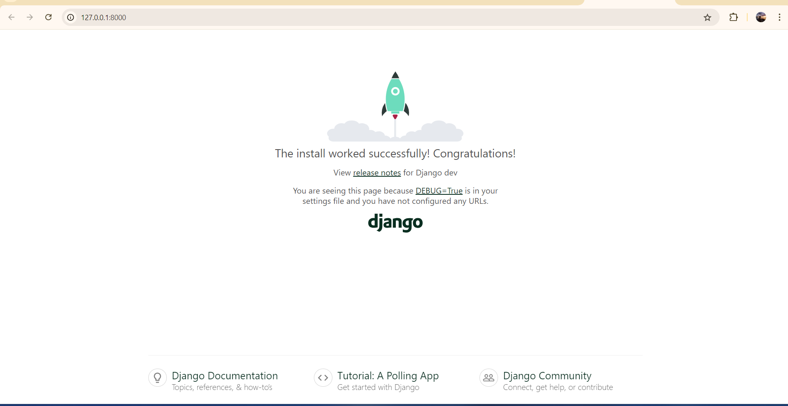
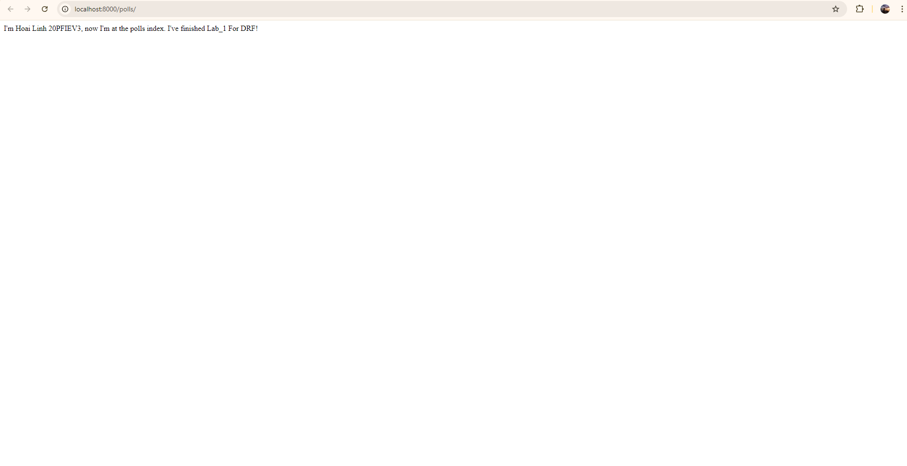
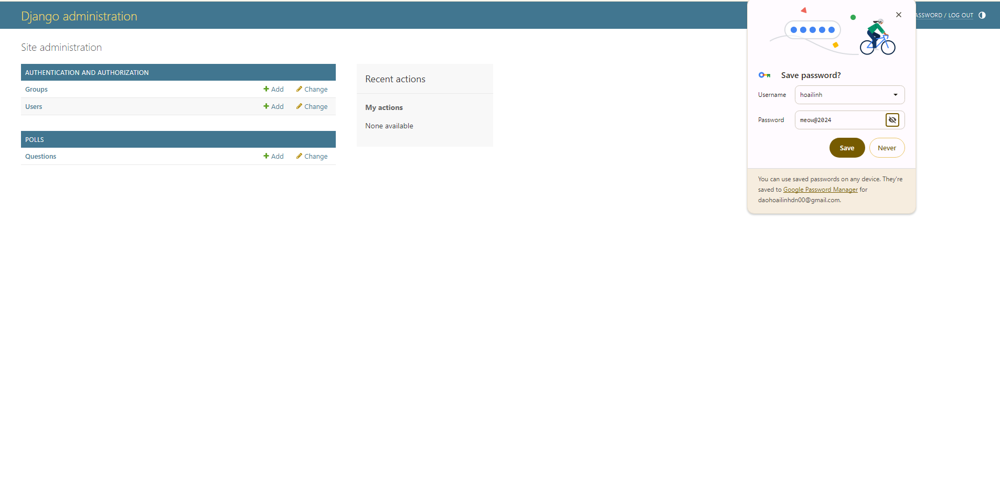
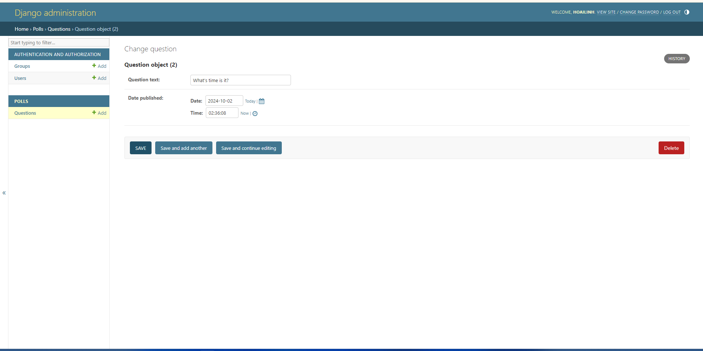
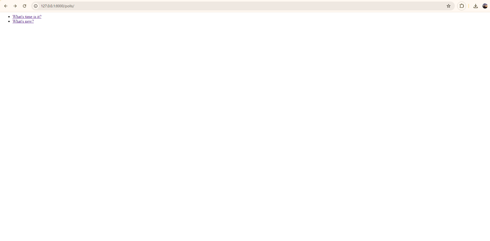
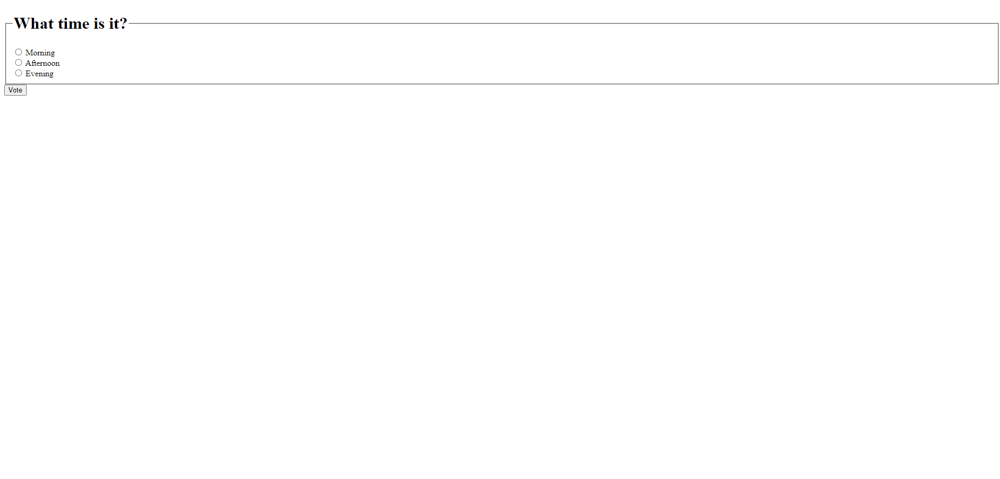
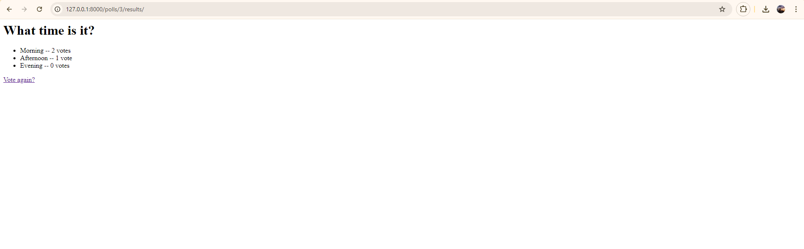

# Lab_1 in Django Tutorials: Writing my first Django - DRF Course - Hoai Linh 20PFIEV3 - 123200107

## Link of Tutorials:

https://docs.djangoproject.com/en/5.1/intro

## Part_1

Consist of two parts:
- A public site that lets people view polls and vote in them.
- An admin site that lets you add, and delete polls.

### Step 0.1. Check version (no need):
```bash
python -m django --version
```

### Step 0.2. Activate the environment (Specifically for my PC :D):
```bash
source /c/ProgramData/anaconda3/Scripts/activate
conda activate ./env
```

---

### Step 1. Create a project

- Run this command in the directory containing your project:
  ```bash
  django-admin startproject mysite
  ```

- "mysite" is the name we give. For example, I named my project **LinhSite**.

#### Project structure after creation:

```plaintext
LinhSite/
    manage.py
    LinhSite/
        __init__.py
        settings.py
        urls.py
        asgi.py
        wsgi.py
```

Ok, we will talk about each file:
- The **Outer `LinhSite/`**: A container for the entire project. You can rename it.
- The **`manage.py`**: A command-line utility that lets you interact with Django in various ways. (Read more at [django-admin](https://docs.djangoproject.com/en/5.1/ref/django-admin/)). (It's still pretty vague at the moment :v, but I know it's very important to the project.)
- The **Inner `LinhSite/`**: The actual Python package for your project, used to import components (e.g., `LinhSite.urls`).

#### Specific files:
- **`__init__.py`**: An empty file that tells Python this directory should be considered a package.
- **`settings.py`**: Configuration file for the Django project. (Read more at [Django settings](https://docs.djangoproject.com/en/5.1/topics/settings/)).
- **`urls.py`**: The URL declarations for the project (similar to a table of contents for your site). (Read more at [Django URLs](https://docs.djangoproject.com/en/5.1/topics/http/urls/)).
- **`asgi.py`**: The entry-point for ASGI-compatible web servers to serve your project, handling asynchronous tasks. (Read more about [ASGI](https://docs.djangoproject.com/en/5.1/howto/deployment/asgi/)).
- **`wsgi.py`**: The entry-point for WSGI-compatible web servers to serve your project, handling synchronous tasks. (Read more about [WSGI](https://docs.djangoproject.com/en/5.1/howto/deployment/wsgi/)).

#### Knowledge on WSGI and ASGI:

- **WSGI (Web Server Gateway Interface)**: A standard interface for web servers and web applications, designed for synchronous tasks. WSGI processes one HTTP request at a time, making it ideal for traditional web frameworks like Django and Flask.

- **ASGI (Asynchronous Server Gateway Interface)**: A newer standard supporting both synchronous and asynchronous applications. ASGI allows handling of multiple tasks concurrently, such as WebSocket connections or asynchronous HTTP requests, making it ideal for real-time applications.

---

### Step 2. Verify project setup

- Run the command:
  ```bash
  python manage.py runserver
  ```

- Result in the browser: Access `http://127.0.0.1:8000/`.
- 
- And my result in Terminal:
```plaintext
    Watching for file changes with StatReloader
    Performing system checks...

    System check identified no issues (0 silenced).

    You have 18 unapplied migration(s). Your project may not work properly until you apply the migrations for app(s): admin, auth, contenttypes, sessions.
    Run 'python manage.py migrate' to apply them.
    September 27, 2024 - 02:25:00
    Django version 5.2.dev20240911160443, using settings 'LinhSite.settings'
    Starting development server at http://127.0.0.1:8000/
    Quit the server with CTRL-BREAK.
  ```

- Run the following command to apply the migrations:
  ```bash
  python manage.py migrate
  ```
  
#### Knowledge:
- This is a lightweight web server written purely in Python. We can develop things rapidly and easily.
- Compared with production server - such as Apache or Nginx - with more complicated configuration.
- Django provides the web frameworks for development progress, not web servers for production progress.

---

### Step 3. Create the Polls app

- Run the following command in the same directory as `manage.py`:
  ```bash
  python manage.py startapp polls
  ```
  
#### Knowledge:

- What’s the difference between a project and an app? An app is a web application that does something – e.g., a blog system, a database of public records or a small poll app. A project is a collection of configuration and apps for a particular website. A project can contain multiple apps. An app can be in multiple projects.

#### App structure for **polls**:
```plaintext
polls/
    __init__.py
    admin.py
    apps.py
    migrations/
        __init__.py
    models.py
    tests.py
    views.py
```

---

### Step 4. Write the first view

- Open the `polls/views.py` file and add the following code:
  ```python
  from django.http import HttpResponse

  def index(request):
      return HttpResponse("I'm Hoai Linh 20PFIEV3, now I'm at the polls index. I've finished Lab_1 For DRF!")
  ```

- This is the most basic view possible in Django. To access it in a browser, we need to map it to a URL. To do this, we need to define a URL configuration, or 'URLconf' for short. These URL configurations are defined inside each Django app, and they are Python files named `urls.py`.

- To define a URLconf for the polls app, create a file `polls/urls.py` with the following content:
  ```python
  from django.urls import path
  from . import views

  urlpatterns = [
      path("", views.index, name="index"),
  ]
  ```

---

### Step 5. Configure the global URLconf in the LinhSite project to include the URLconf defined in poll urls

- To do this, add an import for `django.urls.include` in `LinhSite/urls.py` and insert an `include()` in the `urlpatterns` list, so we have:
  ```python
  from django.contrib import admin
  from django.urls import include, path

  urlpatterns = [
      path("polls/", include("polls.urls")),
      path("admin/", admin.site.urls),
  ]
  ```
  
- The `include()` function allows referencing other URLconfs.
  - The `path("polls/", include("polls.urls"))` tells Django: "Whenever the URL starts with `polls/`, look for more URL patterns in the `polls` app's `urls.py` file."
  - Inside the `polls/urls.py`, you can define the specific endpoints for the polls app (e.g., `polls/vote`, `polls/results`), and `include()` will forward the requests to those URLs.
  - **When to use**: When you want to include other URL patterns, but `admin.site.urls` is the only exception to this.

- The `path()` function expects at least two arguments: `route` and `view`.
  - For example, `route: admin/` and `poll/` correspond to different apps, and `view` is the class or function handling the request for the URL that you defined in the `route`.
  
- All of the above processing has ensured that we have wired an index view into the URLconf! Check it by running the command:
  ```bash
  python manage.py runserver
  ```

- Access `http://localhost:8000/polls/` to see the result. Be careful not to confuse this with accessing just `http://localhost:8000/` :v.
- The text “I'm Hoai Linh 20PFIEV3, now I'm at the polls index. I've finished Lab_1 For DRF!”, which I defined in the index view, should appear.
- 

---

### Summary:
In this part of the tutorial, we created a basic Django project, set up a polls app, and configured views and URLs to display the index page.

## Part_2

This tutorial begins where Part 1 left off. We’ll set up the database, create your first model, and get a quick introduction to Django’s automatically-generated admin site.

### Step 1: Set up the Database

- By default, Django uses SQLite. In this project, we will use the default configuration.
- Open `LinhSite/settings.py` and check the **DATABASES** section.
- Set **TIME_ZONE** to your time zone:
  ```python
  TIME_ZONE = 'Asia/Ho_Chi_Minh'
  ```

- Then, run the command to apply migrations for built-in apps:
  ```bash
  python manage.py migrate
  ```

---

### Step 2: Create Models

- Now let’s define the models in `polls/models.py`.

- Open `polls/models.py` and define the models `Question` and `Choice` like this:
  ```python
  from django.db import models

  class Question(models.Model):
      question_text = models.CharField(max_length=200)
      pub_date = models.DateTimeField('date published')

  class Choice(models.Model):
      question = models.ForeignKey(Question, on_delete=models.CASCADE)
      choice_text = models.CharField(max_length=200)
      votes = models.IntegerField(default=0)
  ```
  
#### Knowledge:
- Each field in a model is represented by a class variable, and each field maps to a column in the database.

---

### Step 3: Activate the Models

- To activate the `polls` app in your project, you need to include it in `LinhSite/settings.py`.
- Open `LinhSite/settings.py` and add the `PollsConfig` class to the **INSTALLED_APPS** list:
  ```python
  INSTALLED_APPS = [
      'polls.apps.PollsConfig',
      'django.contrib.admin',
      'django.contrib.auth',
      'django.contrib.contenttypes',
      'django.contrib.sessions',
      'django.contrib.messages',
      'django.contrib.staticfiles',
  ]
  ```

---

### Step 4: Create Migrations

- Run the command to create migrations for the `polls` app:
  ```bash
  python manage.py makemigrations polls
  ```

- Then, run the migration command to apply the changes:
  ```bash
  python manage.py migrate
  ```

- You can also check the generated SQL using the following command:
  ```bash
  python manage.py sqlmigrate polls 0001
  ```

---

### Step 5: Create a Superuser

- Run the following command to create a superuser for the Django admin site:
  ```bash
  python manage.py createsuperuser
  ```
- I entered the following details:
  - Username: `hoailinh`
  - Email: `daohoailinhdn00@gmail.com`
  - Password: `meow@2024`

- After creating the superuser, you should see the following message:
  ```plaintext
  Superuser created successfully.
  ```

---

### Step 6: Activate the Admin Interface for Models

- To make the `Question` model editable in the admin site, register it in `polls/admin.py`.

- Open `polls/admin.py` and add the following code:
  ```python
  from django.contrib import admin
  from .models import Question

  admin.site.register(Question)
  ```

---

### Step 7: Run the Development Server

- Finally, run the development server using:
  ```bash
  python manage.py runserver
  ```

- Open your browser and navigate to `http://127.0.0.1:8000/admin/`.
- Log in using the superuser credentials (`hoailinh`, `meow@2024`), and you will see the `Question` model registered in the admin site.

- Here’s the result in my browser and add new question:
- 
- 
---

### Summary:
In Part 2, we set up the database, created the models, activated them, and registered them in the Django admin site. We also learned how to create migrations and run them to apply model changes.

## Part_3

In this part, we are extending the polls app by adding more views and using Django's template system to render the data in a more structured way.

### Step 1. Write more views

We will add three new views in `polls/views.py`. These views will display details about specific questions and handle voting functionality. Modify the file to look like this:

```python
from django.http import HttpResponse

def detail(request, question_id):
    return HttpResponse("You're looking at question %s." % question_id)

def results(request, question_id):
    response = "You're looking at the results of question %s."
    return HttpResponse(response % question_id)

def vote(request, question_id):
    return HttpResponse("You're voting on question %s." % question_id)
```

### Step 2. Map the new views

Next, we need to wire these views to URLs in `polls/urls.py`. Add the following paths:

```python
from django.urls import path
from . import views

app_name = "polls"
urlpatterns = [
    path("", views.index, name="index"),
    path("<int:question_id>/", views.detail, name="detail"),
    path("<int:question_id>/results/", views.results, name="results"),
    path("<int:question_id>/vote/", views.vote, name="vote"),
]
```

### Step 3. Update the index view to use a template

Instead of hardcoding the HTML in the views, we will use Django's template system. Create a folder called `templates` inside the `polls` directory and another folder inside it called `polls`. Then, create a file named `index.html` inside this folder with the following content:

```html

    <ul>
    
        <li><a href="">{{ question.question_text }}</a></li>
    
    </ul>

    <p>No polls are available.</p>

```

Update the `index` view in `polls/views.py` to use this template:

```python
from django.shortcuts import render
from .models import Question

def index(request):
    latest_question_list = Question.objects.order_by("-pub_date")[:5]
    context = {"latest_question_list": latest_question_list}
    return render(request, "polls/index.html", context)
```

### Step 4. Rendering the views in the browser

Once the templates and views are updated, run the development server again and access `http://127.0.0.1:8000/polls/`. The list of questions should now be displayed as links. When you click on a question, it will take you to the detail page of that specific question (though it still returns plain text at this point).

Here's a preview of what the page should look like after completing Part 3:


### Summary:

In this part, we learned how to:
- Add more views to display specific details about poll questions.
- Use the template system to render data dynamically in the browser.
- Organize URL patterns to match different views.

By now, we should be able to navigate through the list of questions and view each one’s details.

## Part_4: 

In this part, we will process form submissions and utilize Django’s generic views for better code efficiency.

---

### Step 1. Update the Poll Detail Template with a Form

- We will update the `polls/detail.html` file to include a form that allows users to vote on a poll.

#### File: `polls/templates/polls/detail.html`

```html
<form action="" method="post">

<fieldset>
    <legend><h1>{{ question.question_text }}</h1></legend>
    <p><strong>{{ error_message }}</strong></p>
    
        <input type="radio" name="choice" id="choice{{ forloop.counter }}" value="{{ choice.id }}">
        <label for="choice{{ forloop.counter }}">{{ choice.choice_text }}</label><br>
    
</fieldset>
<input type="submit" value="Vote">
</form>
```

- The form allows the user to submit a vote. Each choice is displayed as a radio button with a label, and the form submits the choice ID via a POST request.

---

### Step 2. Implement Form Handling Logic in the View

- Now, we will write the logic for handling the form submission in the `vote` view.

#### File: `polls/views.py`

```python
from django.db.models import F
from django.http import HttpResponseRedirect
from django.shortcuts import get_object_or_404, render
from django.urls import reverse

from .models import Choice, Question

def vote(request, question_id):
    question = get_object_or_404(Question, pk=question_id)
    try:
        selected_choice = question.choice_set.get(pk=request.POST['choice'])
    except (KeyError, Choice.DoesNotExist):
        return render(request, 'polls/detail.html', {
            'question': question,
            'error_message': "You didn't select a choice.",
        })
    else:
        selected_choice.votes = F('votes') + 1
        selected_choice.save()
        return HttpResponseRedirect(reverse('polls:results', args=(question.id,)))
```

- This view handles the form data submitted by the user. If the user doesn’t select a choice, it redisplays the form with an error message. If a choice is selected, the vote count is updated and the user is redirected to the results page.

---

### Step 3. Create the Results View and Template

- Once a vote is submitted, we need to display the results. Create a new view and a results template.

#### File: `polls/views.py`

```python
from django.shortcuts import get_object_or_404, render

def results(request, question_id):
    question = get_object_or_404(Question, pk=question_id)
    return render(request, 'polls/results.html', {'question': question})
```

#### File: `polls/templates/polls/results.html`

```html
<h1>{{ question.question_text }}</h1>
<ul>

    <li>{{ choice.choice_text }} -- {{ choice.votes }} vote{{ choice.votes|pluralize }}</li>

</ul>
<a href="">Vote again?</a>
```

- The results page will show the total number of votes for each choice, using the `pluralize` filter to correctly format "vote" as singular or plural.

---

### Step 4. Optimize with Generic Views

- To reduce redundancy in our code, we will use Django's **generic views**.

#### File: `polls/urls.py`

```python
from django.urls import path

from . import views

app_name = 'polls'
urlpatterns = [
    path('', views.IndexView.as_view(), name='index'),
    path('<int:pk>/', views.DetailView.as_view(), name='detail'),
    path('<int:pk>/results/', views.ResultsView.as_view(), name='results'),
    path('<int:question_id>/vote/', views.vote, name='vote'),
]
```

- Here, we replaced the old views with `IndexView`, `DetailView`, and `ResultsView` for simplicity.

#### File: `polls/views.py`

```python
from django.views import generic

from .models import Question

class IndexView(generic.ListView):
    template_name = 'polls/index.html'
    context_object_name = 'latest_question_list'

    def get_queryset(self):
        return Question.objects.order_by('-pub_date')[:5]

class DetailView(generic.DetailView):
    model = Question
    template_name = 'polls/detail.html'

class ResultsView(generic.DetailView):
    model = Question
    template_name = 'polls/results.html'
```

- `ListView` and `DetailView` are used to display the list of questions and the details for each question, respectively.

---

### Step 5. Test the Implementation

- After making these changes, restart the Django development server and test the application.

```bash
python manage.py runserver
```

- Open your browser and go to `/polls/` to see the list of polls. Select a poll, vote, and view the results.

- After successful voting, the result page will display the number of votes for each choice.




---

### Summary:

Now we processed form data and introduced generic views to make our Django app more efficient.

## Part 5

In this part, we will build automated tests for the web-poll application we've created in the previous parts. We'll start by identifying a bug in our app and create automated tests to ensure that this bug (and others) don't affect the functionality of our app in the future.

---

### Step 1: Identifying the bug

We identified that the `was_published_recently()` method for `Question` returns `True` for future dates, which is incorrect. Let's confirm this issue using the Django shell.

#### Running the Django shell to check the bug:
```bash
$ python manage.py shell
>>> import datetime
>>> from django.utils import timezone
>>> from polls.models import Question
>>> # Create a Question with a pub_date 30 days in the future
>>> future_question = Question(pub_date=timezone.now() + datetime.timedelta(days=30))
>>> future_question.was_published_recently()
True
```

This is a problem since future questions should not be considered "recently published."

---

### Step 2: Create a test to expose the bug

Let's write a test that checks if the `was_published_recently()` method returns `False` for questions with future `pub_date`.

#### Editing `polls/tests.py`:
```python
import datetime
from django.test import TestCase
from django.utils import timezone
from polls.models import Question

class QuestionModelTests(TestCase):
    def test_was_published_recently_with_future_question(self):
        '''
        was_published_recently() returns False for questions whose pub_date
        is in the future.
        '''
        time = timezone.now() + datetime.timedelta(days=30)
        future_question = Question(pub_date=time)
        self.assertIs(future_question.was_published_recently(), False)
```

---

### Step 3: Run the test

We run the test to check for failures, and as expected, the test fails, confirming that our function behaves incorrectly for future dates.

#### Command:
```bash
$ python manage.py test polls
```

#### Output:
```plaintext
Found 1 test(s).
Creating test database for alias 'default'...
System check identified no issues (0 silenced).
F
======================================================================
FAIL: test_was_published_recently_with_future_question (polls.tests.QuestionModelTests)
----------------------------------------------------------------------
Traceback (most recent call last):
  File "D:/Works/Semester_9/DRF/DRF-Practice/Lab_1/LinhSite/polls/tests.py", line 17, in test_was_published_recently_with_future_question
    self.assertIs(future_question.was_published_recently(), False)
AssertionError: True is not False
----------------------------------------------------------------------

Ran 1 test in 0.001s

FAILED (failures=1)
Destroying test database for alias 'default'...
```

*Explanation:* The test correctly fails, indicating that the method is returning `True` for future questions.

---

### Step 4: Fix the bug

Now, let's fix the `was_published_recently()` method in the `polls/models.py`.

#### Editing `polls/models.py`:
```python
from django.utils import timezone

class Question(models.Model):
    # ...
    def was_published_recently(self):
        '''
        Returns True if the question was published within the last day.
        Returns False if the question's pub_date is in the future.
        '''
        now = timezone.now()
        return now - datetime.timedelta(days=1) <= self.pub_date <= now
```

---

### Step 5: Run the test again

Let's re-run the test to see if the bug has been fixed.

#### Command:
```bash
$ python manage.py test polls
```

#### Output:
```plaintext
Found 1 test(s).
Creating test database for alias 'default'...
System check identified no issues (0 silenced).
.
----------------------------------------------------------------------

Ran 1 test in 0.001s

OK
Destroying test database for alias 'default'...
```

*Explanation:* The test now passes, confirming that our bug fix works as intended.

---

### Step 6: Writing additional tests

Now that the bug has been fixed, let's add more tests to cover different scenarios, such as when the question's `pub_date` is in the past or within the last day.

#### Adding more tests to `polls/tests.py`:
```python
def test_was_published_recently_with_old_question(self):
    '''
    was_published_recently() returns False for questions whose pub_date
    is older than 1 day.
    '''
    time = timezone.now() - datetime.timedelta(days=1, seconds=1)
    old_question = Question(pub_date=time)
    self.assertIs(old_question.was_published_recently(), False)

def test_was_published_recently_with_recent_question(self):
    '''
    was_published_recently() returns True for questions whose pub_date
    is within the last day.
    '''
    time = timezone.now() - datetime.timedelta(hours=23, minutes=59, seconds=59)
    recent_question = Question(pub_date=time)
    self.assertIs(recent_question.was_published_recently(), True)
```

---

### Step 7: Running all tests

Finally, let's run all the tests to ensure everything works as expected.

#### Command:
```bash
$ python manage.py test polls
```

#### Output:
```plaintext
Found 6 test(s).
Creating test database for alias 'default'...
System check identified no issues (0 silenced).
F.....
======================================================================
FAIL: test_future_question (polls.tests.QuestionIndexViewTests)
----------------------------------------------------------------------
Traceback (most recent call last):
  File "D:/Works/Semester_9/DRF/DRF-Practice/Lab_1/LinhSite/polls/tests.py", line 60, in test_future_question
    self.assertContains(response, "No polls are available.")
AssertionError: False is not true : Couldn't find 'No polls are available.' in the following response
b'
    <ul>
    
        
        
        <li><a href="/polls/1/">Future question.</a></li>

    
    </ul>

'

----------------------------------------------------------------------

Ran 6 tests in 0.069s

FAILED (failures=1)
Destroying test database for alias 'default'...
```

*Explanation:* The test failed because a future question was displayed, which should not have happened. We need to adjust our `get_queryset()` method in the view.

---

### Step 8: Fixing the view

Let's fix the `get_queryset()` method to ensure future questions are not displayed on the index page.

#### Editing `polls/views.py`:
```python
from django.utils import timezone

class IndexView(generic.ListView):
    template_name = "polls/index.html"
    context_object_name = "latest_question_list"

    def get_queryset(self):
        '''
        Return the last five published questions (not including those set to be
        published in the future).
        '''
        return Question.objects.filter(pub_date__lte=timezone.now()).order_by('-pub_date')[:5]
```

---

### Step 9: Running the tests again

After fixing the view, we run the tests again.

#### Command:
```bash
$ python manage.py test polls
```

#### Output:
```plaintext
Found 6 test(s).
Creating test database for alias 'default'...
System check identified no issues (0 silenced).
......
----------------------------------------------------------------------

Ran 6 tests in 0.068s

OK
Destroying test database for alias 'default'...
```

*Explanation:* All tests passed successfully, which confirms that our view logic works correctly now.

---

### Summary

In this part of the tutorial, we learned how to write tests for our Django application, identify bugs, and fix them through test-driven development. We also ensured that our app displays only the relevant questions by filtering out future questions.
