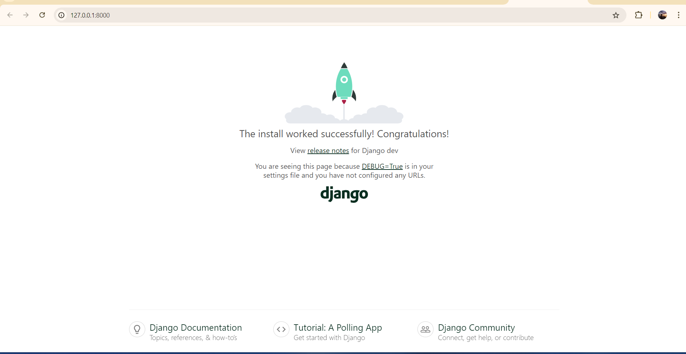

# Lab_1 in Django Tutorials: Writing my first Django - DRF Course - Hoai Linh 20PFIEV3 - 123200107

## Part_1

Consist of two parts:
- A public site that lets people view polls and vote in them.
- An admin site that lets you add, and delete polls.

### Step 0.1. Check version (no need):
```bash
python -m django --version
```

### Step 0.2. Activate the environment (Specifically for my PC :D):
```bash
source /c/ProgramData/anaconda3/Scripts/activate
conda activate ./env
```

---

### Step 1. Create a project

- Run this command in the directory containing your project:
  ```bash
  django-admin startproject mysite
  ```

- "mysite" is the name we give. For example, I named my project **LinhSite**.

#### Project structure after creation:

```plaintext
LinhSite/
    manage.py
    LinhSite/
        __init__.py
        settings.py
        urls.py
        asgi.py
        wsgi.py
```

Ok, we will talk about each file:
- The **Outer `LinhSite/`**: A container for the entire project. You can rename it.
- The **`manage.py`**: A command-line utility that lets you interact with Django in various ways. (Read more at [django-admin](https://docs.djangoproject.com/en/5.1/ref/django-admin/)). (It's still pretty vague at the moment :v, but I know it's very important to the project.)
- The **Inner `LinhSite/`**: The actual Python package for your project, used to import components (e.g., `LinhSite.urls`).

#### Specific files:
- **`__init__.py`**: An empty file that tells Python this directory should be considered a package.
- **`settings.py`**: Configuration file for the Django project. (Read more at [Django settings](https://docs.djangoproject.com/en/5.1/topics/settings/)).
- **`urls.py`**: The URL declarations for the project (similar to a table of contents for your site). (Read more at [Django URLs](https://docs.djangoproject.com/en/5.1/topics/http/urls/)).
- **`asgi.py`**: The entry-point for ASGI-compatible web servers to serve your project, handling asynchronous tasks. (Read more about [ASGI](https://docs.djangoproject.com/en/5.1/howto/deployment/asgi/)).
- **`wsgi.py`**: The entry-point for WSGI-compatible web servers to serve your project, handling synchronous tasks. (Read more about [WSGI](https://docs.djangoproject.com/en/5.1/howto/deployment/wsgi/)).

#### Additional information on WSGI and ASGI:

- **WSGI (Web Server Gateway Interface)**: A standard interface for web servers and web applications, designed for synchronous tasks. WSGI processes one HTTP request at a time, making it ideal for traditional web frameworks like Django and Flask.

- **ASGI (Asynchronous Server Gateway Interface)**: A newer standard supporting both synchronous and asynchronous applications. ASGI allows handling of multiple tasks concurrently, such as WebSocket connections or asynchronous HTTP requests, making it ideal for real-time applications.

---

### Step 2. Verify project setup

- Run the command:
  ```bash
  python manage.py runserver
  ```

- Result in the browser: Access `http://127.0.0.1:8000/`.
- 

#### Output:
```plaintext
You have 18 unapplied migration(s). Your project may not work properly until you apply the migrations for app(s): admin, auth, contenttypes, sessions.
```

- Run the following command to apply the migrations:
  ```bash
  python manage.py migrate
  ```

---

### Step 3. Create the Polls app

- Run the following command in the same directory as `manage.py`:
  ```bash
  python manage.py startapp polls
  ```

Knowledge:

- What’s the difference between a project and an app? An app is a web application that does something – e.g., a blog system, a database of public records or a small poll app. A project is a collection of configuration and apps for a particular website. A project can contain multiple apps. An app can be in multiple projects.

#### App structure for **polls**:
```plaintext
polls/
    __init__.py
    admin.py
    apps.py
    migrations/
        __init__.py
    models.py
    tests.py
    views.py
```

---

### Step 4. Write the first view

- Open the `polls/views.py` file and add the following code:
  ```python
  from django.http import HttpResponse

  def index(request):
      return HttpResponse("I'm Hoai Linh 20PFIEV3, now I'm at the polls index. I've finished Lab_1 For DRF!")
  ```

- To connect this view to a URL, create a file `polls/urls.py` with the following content:
  ```python
  from django.urls import path
  from . import views

  urlpatterns = [
      path("", views.index, name="index"),
  ]
  ```

---

### Step 5. Configure the global URLconf

- Open the `LinhSite/urls.py` file and modify it as follows:
  ```python
  from django.contrib import admin
  from django.urls import include, path

  urlpatterns = [
      path("polls/", include("polls.urls")),
      path("admin/", admin.site.urls),
  ]
  ```

- Access `http://localhost:8000/polls/` to see the result.
- 

---

### Summary:
In this part of the tutorial, we created a basic Django project, set up a polls app, and configured views and URLs to display the index page.
